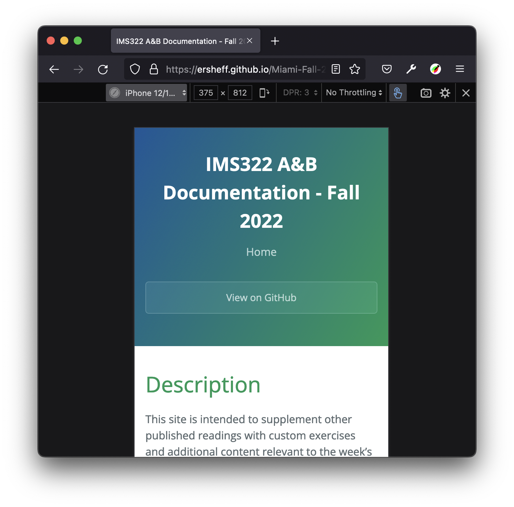

# Responsive Web Design

[Home](index.md)

Read the [section on responsive design](https://developer.mozilla.org/en-US/docs/Learn/CSS/CSS_layout/Responsive_Design#responsive_design) (RWD) in the MDN Web Docs. We will focus on the 3 techniques listed in that article:  fluid images, fluid grids, and media queries.
  
## Fluid Images
If you adjust the size of the browser window (you may want to "Edit on CodePen" for this), you'll notice that the images that have their widths set as percentages will fluidly adjust to maintain their relative proportions. Of particular interest is the second dog photo - it is inside of a `
` element (blue background) that has a width of 50% relative to the `<body>`, while the image itself also has a width of 50%. However, the image width is relative to its *parent* element, so it is 50% of the `
`.

Percentages are *absolutely crucial* when developing pages with fluid images in fluid grids. However, they can also cause issues at extreme large or small window sizes. Using the `min-width` and `max-width` properties combined with a 100% `width` (as seen on the third image) can help ensure that the photo is at an ideal size no matter the browser window size.

  See the Pen <a href="https://codepen.io/ersheff/pen/poZQbeX">
  IMS322-Fluid-Images</a> by Eric Sheffield (<a href="https://codepen.io/ersheff">@ersheff</a>)
  on <a href="https://codepen.io">CodePen</a>.

### Aspect Ratio
One of the worst things that you can do to a lovely image is destroy its aspect ratio. Phones and professional cameras commonly shoot at 4:3 or 3:2. This can certainly be changed with cropping, but you should always try and prevent any squishing or stretching in CSS.

Take a look at the multiple versions of the black dog photo below. The first one is destroyed because I've combined a relative `width` (%) with an absolute `height` (px). As the size of the preview panel is changed, the picture becomes more or less distorted as its width changes while its height stays the same.

An easy way to fix this is to only specify one dimension or the other - `width` OR `height`. In the second image, I've only specified the width - the height automatically respects the image aspect ratio, and the overall size still adjusts relative to the parent element.

  See the Pen <a href="https://codepen.io/ersheff/pen/qBovObg">
  IMS322-Aspect-Ratio</a> by Eric Sheffield (<a href="https://codepen.io/ersheff">@ersheff</a>)
  on <a href="https://codepen.io">CodePen</a>.

  
## Fluid Grids (Flexbox)
Flexbox is one of the indispensible tools to achieve the "fluid grids" part of RWD. In short, a flexbox is a flexible layout method in which a container (parent) and its items (children) can automatically adjust their layout in response to the size of the window. It can also be very handy for alignment - specifically, centering content both horizontally and vertically, even if it is only one item.  

This first example demonstrates:
- The `display` property of the container set to "flex" to create a flexbox row
- The `gap` property of the container (space between items)
- The `align-items` property of the container (vertical alignment)
- The `justify-content` property of the container (horizontal spacing and alignment)

Try adjusting the size of the preview and changing some of the values specified for CSS properties - in particular, the width of the flex items (again, this may work best if you click the "Edit on CodePen" link to open the pen in a separate editor).

  See the Pen <a href="https://codepen.io/ersheff/pen/MWVxamV">
  IMS322-Flexbox1</a> by Eric Sheffield (<a href="https://codepen.io/ersheff">@ersheff</a>)
  on <a href="https://codepen.io">CodePen</a>.

A couple of additional properties are demonstrated in the next example, namely:
- Giving flex items different `flex` property values to adjust their relative proportions (item 3 is twice the width of items 1 and 2)
- Changing the flex-direction to `column` (row is the default)

  See the Pen <a href="https://codepen.io/ersheff/pen/WNzmEGK">
  IMS322-Flexbox2</a> by Eric Sheffield (<a href="https://codepen.io/ersheff">@ersheff</a>)
  on <a href="https://codepen.io">CodePen</a>.

In general, flexbox is thought of as one-dimensional, either rows or columns. However, you can create a more sophiticated layout by embedding flexboxes within each other.  

  See the Pen <a href="https://codepen.io/ersheff/pen/wvmOqeX">
  IMS322-Flexbox3</a> by Eric Sheffield (<a href="https://codepen.io/ersheff">@ersheff</a>)
  on <a href="https://codepen.io">CodePen</a>.

Again, there are way too many flexbox properties to memorize them all. <a href="https://css-tricks.com/snippets/css/a-guide-to-flexbox/" target="_blank">This article on CSS-Tricks</a> is an excellent reference. For now, understanding the properties demonstrated in the examples above and outlined in the bullet points will likely be all you need for some time.  

*<a href="https://css-tricks.com/snippets/css/complete-guide-grid/" target="_blank">CSS Grid</a> is an even more powerful way to design fluid grid layouts. It is a bit more complicated than flexbox, so we will not be looking at grid right now. However, you are welcome to look into it if you have the time and feel comfortable incorporating CSS Grid in your assignments.*
 
 
## Media queries

Media queries can be used to modify CSS properties depending on the characteristics of the display or device. The last flexbox example above actually includes an extremely common application of media queries: changing the flex-direction of a flex container from row to column when the window gets narrow (and vice versa). However, any CSS property can be changed with a media query.

  See the Pen <a href="https://codepen.io/ersheff/pen/wvmOqQQ">
  Week2-6-Media-Queries</a> by Eric Sheffield (<a href="https://codepen.io/ersheff">@ersheff</a>)
  on <a href="https://codepen.io">CodePen</a>.

The general format for a screen-sized based media query is:  

`@media (max-width: 600px) {`  
&nbsp;&nbsp;/\* `stuff that changes goes here`  \*/
`}`  

...where the width value is the threshold at which the changes will happen when the window size changes.  
  
## Responsive Design Mode
Responsive Design Mode is a function of your browser that makes responsive design easier. Specifically, it simulates specific device display sizes and orientations to help you evaluate media query adjustments, element sizes, and layout flow and organization. While simply adjusting the size of your browser window will sometimes be sufficient, Repsonsive Design Mode is a much more accurate, flexible, and reliable way to accomplish this. Make sure you know how to activate Responsive Design Mode in your specific browser.
*Example of the Responsive Design Mode view in Firefox, set to display size of iPhone 12/13 Mini.*

